# Class Diagram - Expense Tracker

## Complete System Class Diagram

This diagram shows all major classes, models, and their relationships across the entire MERN stack application.

```mermaid
%%{init: {'primaryColor': '#383854', 'primaryBorderColor': '#d3d3d3', 'lineColor': '#d3d3d3', 'textColor': '#d3d3d3', 'mainBkg': '#383854', 'secondBkg': '#383854', 'tertiaryColor': '#383854'}}%%
classDiagram
    %% =====================
    %% DATABASE LAYER
    %% =====================
    
    class User {
        -_id: ObjectID
        -name: String
        -email: String
        +password: String (hashed)
        -createdAt: Date
        -updatedAt: Date
        +hashPassword(password): void
        +comparePassword(password): Boolean
        +toJSON(): Object
    }
    
    class Expense {
        -_id: ObjectID
        -userId: ObjectID
        -title: String
        -amount: Number
        -category: String (enum)
        -description: String
        -date: Date
        -createdAt: Date
        -updatedAt: Date
        +validate(): Boolean
        +toJSON(): Object
    }
    
    %% =====================
    %% SERVICE LAYER
    %% =====================
    
    class AuthService {
        +register(email, password, name): Promise~User~
        +login(email, password): Promise~Token~
        +validateToken(token): Promise~User~
        +generateToken(userId): String
        +hashPassword(password): String
        +comparePasswords(password, hash): Boolean
    }
    
    class ExpenseService {
        +getExpensesByUser(userId): Promise~Expense[]~
        +getExpenseById(expenseId): Promise~Expense~
        +createExpense(userId, data): Promise~Expense~
        +updateExpense(expenseId, userId, data): Promise~Expense~
        +deleteExpense(expenseId, userId): Promise~Boolean~
        +filterExpenses(userId, filters): Promise~Expense[]~
    }
    
    class StatsService {
        +getTotalExpenses(userId): Promise~Number~
        +getAverageExpense(userId): Promise~Number~
        +getExpensesByCategory(userId): Promise~Object~
        +getExpensesByDateRange(userId, startDate, endDate): Promise~Expense[]~
        +calculateMonthlyStats(userId): Promise~Object~
    }
    
    %% =====================
    %% CONTROLLER/ROUTE LAYER
    %% =====================
    
    class AuthController {
        +register(req, res): void
        +login(req, res): void
        +getProfile(req, res): void
        +logout(req, res): void
    }
    
    class ExpenseController {
        +getAll(req, res): void
        +getById(req, res): void
        +create(req, res): void
        +update(req, res): void
        +delete(req, res): void
        +getStats(req, res): void
    }
    
    %% =====================
    %% MIDDLEWARE LAYER
    %% =====================
    
    class AuthMiddleware {
        -secretKey: String
        +verifyToken(req, res, next): void
        +validateJWT(token): Promise~Object~
        +extractUserId(token): String
    }
    
    class ValidationMiddleware {
        +validateExpense(req, res, next): void
        +validateUser(req, res, next): void
        +validateEmail(email): Boolean
        +validateAmount(amount): Boolean
    }
    
    class ErrorHandler {
        +handle(error, req, res, next): void
        +formatError(error): Object
        +logError(error): void
        +sendErrorResponse(res, statusCode, message): void
    }
    
    %% =====================
    %% FRONTEND - REACT COMPONENTS
    %% =====================
    
    class AuthContext {
        -user: User
        -token: String
        -isAuthenticated: Boolean
        -loading: Boolean
        +login(email, password): Promise~void~
        +register(name, email, password): Promise~void~
        +logout(): void
        +updateUser(user): void
    }
    
    class ExpenseContext {
        -expenses: Expense[]
        -stats: Object
        -loading: Boolean
        -error: String
        +addExpense(expense): void
        +updateExpense(expense): void
        +deleteExpense(expenseId): void
        +setExpenses(expenses): void
        +setStats(stats): void
    }
    
    class Login {
        -email: String
        -password: String
        -error: String
        -loading: Boolean
        +handleLogin(): void
        +handleRegisterRedirect(): void
        +render(): JSX
    }
    
    class Register {
        -name: String
        -email: String
        -password: String
        -confirmPassword: String
        -error: String
        +handleRegister(): void
        +handleLoginRedirect(): void
        +render(): JSX
    }
    
    class Dashboard {
        -stats: Object
        -loading: Boolean
        +fetchStats(): void
        +handleLogout(): void
        +render(): JSX
    }
    
    class AllExpenses {
        -expenses: Expense[]
        -filters: Object
        -loading: Boolean
        +fetchExpenses(): void
        +handleFilter(): void
        +render(): JSX
    }
    
    class ExpenseDetail {
        -expense: Expense
        -loading: Boolean
        +fetchExpense(): void
        +render(): JSX
    }
    
    class ExpenseForm {
        -title: String
        -amount: Number
        -category: String
        -date: Date
        -description: String
        +handleSubmit(): void
        +validateForm(): Boolean
        +handleCancel(): void
        +render(): JSX
    }
    
    class ExpenseList {
        -expenses: Expense[]
        -onEdit(expense): void
        -onDelete(expenseId): void
        +render(): JSX
    }
    
    class ExpenseStats {
        -stats: Object
        +displayCards(): JSX
        +displayChart(): JSX
        +render(): JSX
    }
    
    class Navbar {
        -user: User
        +handleLogout(): void
        +render(): JSX
    }
    
    class PrivateRoute {
        -isAuthenticated: Boolean
        -component: Component
        +render(): JSX
    }
    
    class APIService {
        -baseURL: String
        -token: String
        +setToken(token): void
        +getToken(): String
        +post(endpoint, data): Promise~Object~
        +get(endpoint): Promise~Object~
        +put(endpoint, data): Promise~Object~
        +delete(endpoint): Promise~Object~
    }
    
    %% =====================
    %% RELATIONSHIPS
    %% =====================
    
    %% User relationships
    User "1" --> "*" Expense : has
    
    %% Service relationships
    AuthService --> User : uses
    ExpenseService --> Expense : uses
    StatsService --> Expense : uses
    
    %% Controller relationships
    AuthController --> AuthService : calls
    ExpenseController --> ExpenseService : calls
    ExpenseController --> StatsService : calls
    
    %% Middleware relationships
    AuthMiddleware --> User : verifies
    ValidationMiddleware --> Expense : validates
    ErrorHandler --> AuthController : handles
    ErrorHandler --> ExpenseController : handles
    
    %% Frontend Context relationships
    AuthContext --> User : manages
    ExpenseContext --> Expense : manages
    
    %% Component relationships
    Login --> AuthContext : uses
    Register --> AuthContext : uses
    Dashboard --> ExpenseContext : uses
    Dashboard --> StatsService : fetches
    AllExpenses --> ExpenseContext : uses
    ExpenseDetail --> ExpenseContext : uses
    ExpenseForm --> ExpenseContext : uses
    ExpenseList --> ExpenseContext : uses
    ExpenseStats --> ExpenseContext : uses
    Navbar --> AuthContext : uses
    PrivateRoute --> AuthContext : checks
    
    %% API Service relationships
    AuthContext --> APIService : calls
    ExpenseContext --> APIService : calls
    
    %% Styling
    style User fill:#e8e8e8,stroke:#383854,stroke-width:2px,color:#383854
    style Expense fill:#e8e8e8,stroke:#383854,stroke-width:2px,color:#383854
    
    style AuthService fill:#e8e8e8,stroke:#383854,stroke-width:2px,color:#383854
    style ExpenseService fill:#e8e8e8,stroke:#383854,stroke-width:2px,color:#383854
    style StatsService fill:#e8e8e8,stroke:#383854,stroke-width:2px,color:#383854
    
    style AuthController fill:#e8e8e8,stroke:#383854,stroke-width:2px,color:#383854
    style ExpenseController fill:#e8e8e8,stroke:#383854,stroke-width:2px,color:#383854
    
    style AuthMiddleware fill:#e8e8e8,stroke:#383854,stroke-width:2px,color:#383854
    style ValidationMiddleware fill:#e8e8e8,stroke:#383854,stroke-width:2px,color:#383854
    style ErrorHandler fill:#e8e8e8,stroke:#383854,stroke-width:2px,color:#383854
    
    style AuthContext fill:#e8e8e8,stroke:#383854,stroke-width:2px,color:#383854
    style ExpenseContext fill:#e8e8e8,stroke:#383854,stroke-width:2px,color:#383854
    
    style Login fill:#e8e8e8,stroke:#383854,stroke-width:2px,color:#383854
    style Register fill:#e8e8e8,stroke:#383854,stroke-width:2px,color:#383854
    style Dashboard fill:#e8e8e8,stroke:#383854,stroke-width:2px,color:#383854
    style AllExpenses fill:#e8e8e8,stroke:#383854,stroke-width:2px,color:#383854
    style ExpenseDetail fill:#e8e8e8,stroke:#383854,stroke-width:2px,color:#383854
    style ExpenseForm fill:#e8e8e8,stroke:#383854,stroke-width:2px,color:#383854
    style ExpenseList fill:#e8e8e8,stroke:#383854,stroke-width:2px,color:#383854
    style ExpenseStats fill:#e8e8e8,stroke:#383854,stroke-width:2px,color:#383854
    style Navbar fill:#e8e8e8,stroke:#383854,stroke-width:2px,color:#383854
    style PrivateRoute fill:#e8e8e8,stroke:#383854,stroke-width:2px,color:#383854
    style APIService fill:#e8e8e8,stroke:#383854,stroke-width:2px,color:#383854
```



---

## Detailed Class Descriptions

### Database Models

#### **User Class**
- **Purpose:** Represents a user account in the system
- **Attributes:**
  - `_id`: Unique MongoDB ObjectID
  - `name`: User's display name
  - `email`: Unique email address
  - `password`: Hashed password (bcryptjs)
  - `createdAt`: Account creation timestamp
  - `updatedAt`: Last update timestamp
- **Methods:**
  - `hashPassword()`: Hash password before storing
  - `comparePassword()`: Verify password during login
  - `toJSON()`: Serialize for API response

#### **Expense Class**
- **Purpose:** Represents an expense record
- **Attributes:**
  - `_id`: Unique MongoDB ObjectID
  - `userId`: Reference to User
  - `title`: Expense name/description
  - `amount`: Expense amount (Number)
  - `category`: Enum (Food, Transport, etc.)
  - `description`: Detailed notes
  - `date`: Date of expense
  - `createdAt`, `updatedAt`: Timestamps
- **Methods:**
  - `validate()`: Check data constraints
  - `toJSON()`: Format for API response

---

### Service Layer

#### **AuthService**
- **Purpose:** Handles authentication logic
- **Key Methods:**
  - `register()`: Create new user account
  - `login()`: Authenticate and generate JWT
  - `validateToken()`: Verify JWT validity
  - `generateToken()`: Create JWT token
  - `hashPassword()`: Secure password hashing
  - `comparePasswords()`: Password verification

#### **ExpenseService**
- **Purpose:** Manages all expense operations
- **Key Methods:**
  - `getExpensesByUser()`: Fetch user's expenses
  - `getExpenseById()`: Get single expense
  - `createExpense()`: Add new expense
  - `updateExpense()`: Modify existing expense
  - `deleteExpense()`: Remove expense
  - `filterExpenses()`: Apply filters & sorting

#### **StatsService**
- **Purpose:** Calculates analytics and statistics
- **Key Methods:**
  - `getTotalExpenses()`: Sum all expenses
  - `getAverageExpense()`: Calculate average
  - `getExpensesByCategory()`: Group by category
  - `getExpensesByDateRange()`: Date-based filtering
  - `calculateMonthlyStats()`: Monthly breakdown

---

### Controller/Route Layer

#### **AuthController**
- **Purpose:** Handles HTTP requests for authentication
- **Methods:**
  - `register()`: POST /api/auth/register
  - `login()`: POST /api/auth/login
  - `getProfile()`: GET /api/auth/profile
  - `logout()`: POST /api/auth/logout

#### **ExpenseController**
- **Purpose:** Handles HTTP requests for expenses
- **Methods:**
  - `getAll()`: GET /api/expenses
  - `getById()`: GET /api/expenses/:id
  - `create()`: POST /api/expenses
  - `update()`: PUT /api/expenses/:id
  - `delete()`: DELETE /api/expenses/:id
  - `getStats()`: GET /api/expenses/stats/summary

---

### Middleware Layer

#### **AuthMiddleware**
- **Purpose:** Verifies JWT tokens on protected routes
- **Methods:**
  - `verifyToken()`: Middleware function
  - `validateJWT()`: Check token signature
  - `extractUserId()`: Get user from token

#### **ValidationMiddleware**
- **Purpose:** Validates incoming request data
- **Methods:**
  - `validateExpense()`: Check expense fields
  - `validateUser()`: Check user fields
  - `validateEmail()`: Email format check
  - `validateAmount()`: Amount validation

#### **ErrorHandler**
- **Purpose:** Centralized error processing
- **Methods:**
  - `handle()`: Process errors
  - `formatError()`: Format error response
  - `logError()`: Log error for debugging
  - `sendErrorResponse()`: Send HTTP error response

---

### Frontend - React Components & Contexts

#### **AuthContext**
- **Purpose:** Global authentication state management
- **State:**
  - `user`: Current logged-in user
  - `token`: JWT token
  - `isAuthenticated`: Boolean flag
  - `loading`: Loading state
- **Methods:**
  - `login()`: Handle login
  - `register()`: Handle registration
  - `logout()`: Clear authentication
  - `updateUser()`: Update user data

#### **ExpenseContext**
- **Purpose:** Global expense state management
- **State:**
  - `expenses`: Array of expenses
  - `stats`: Statistics object
  - `loading`: Loading flag
  - `error`: Error message
- **Methods:**
  - `addExpense()`: Add new expense
  - `updateExpense()`: Modify expense
  - `deleteExpense()`: Remove expense
  - `setExpenses()`: Set full array
  - `setStats()`: Update statistics

#### **Page Components**
- **Login**: User login form with validation
- **Register**: User registration form
- **Dashboard**: Statistics and overview
- **AllExpenses**: List of all expenses with filters
- **ExpenseDetail**: Single expense view

#### **Feature Components**
- **ExpenseForm**: Reusable form for add/edit
- **ExpenseList**: Renders expense items
- **ExpenseStats**: Displays statistical cards & charts
- **Navbar**: Navigation and user menu
- **PrivateRoute**: Protected route wrapper

#### **APIService**
- **Purpose:** Centralized HTTP client with JWT management
- **Methods:**
  - `setToken()`: Store JWT
  - `getToken()`: Retrieve JWT
  - `post()`: POST requests with auth
  - `get()`: GET requests with auth
  - `put()`: PUT requests with auth
  - `delete()`: DELETE requests with auth

---

## Relationships Overview

### Composition & Aggregation

| From | To | Type | Meaning |
|------|-----|------|---------|
| User | Expense | 1:* | User has many Expenses |
| AuthService | User | uses | Service works with User model |
| ExpenseService | Expense | uses | Service works with Expense model |
| StatsService | Expense | uses | Service calculates from Expenses |

### Usage Patterns

| Component | Used By | Purpose |
|-----------|---------|---------|
| AuthService | AuthController | Handle auth requests |
| ExpenseService | ExpenseController | Handle CRUD operations |
| StatsService | ExpenseController | Provide analytics |
| AuthMiddleware | All Routes | Verify JWT on protected routes |
| ValidationMiddleware | All Controllers | Validate input data |
| ErrorHandler | All Controllers | Unified error handling |
| AuthContext | All Components | Global auth state |
| ExpenseContext | Expense Components | Global expense state |
| APIService | Contexts | API communication |

---

## Data Flow Through Classes

### User Registration Flow
```
User Input (Register Component)
  ↓
AuthContext.register()
  ↓
APIService.post('/api/auth/register')
  ↓
AuthController.register()
  ↓
ValidationMiddleware.validateUser()
  ↓
AuthService.register()
  ↓
User.hashPassword()
  ↓
User saved to MongoDB
  ↓
Response returned
```

### Add Expense Flow
```
User Input (ExpenseForm Component)
  ↓
ExpenseContext.addExpense()
  ↓
APIService.post('/api/expenses')
  ↓
AuthMiddleware.verifyToken()
  ↓
ExpenseController.create()
  ↓
ValidationMiddleware.validateExpense()
  ↓
ExpenseService.createExpense()
  ↓
Expense saved to MongoDB
  ↓
ExpenseContext updated
  ↓
UI re-renders
```

### Fetch Statistics Flow
```
Dashboard Component mounted
  ↓
ExpenseContext fetches stats
  ↓
APIService.get('/api/expenses/stats/summary')
  ↓
AuthMiddleware.verifyToken()
  ↓
ExpenseController.getStats()
  ↓
StatsService methods called
  ↓
MongoDB Aggregation Pipeline
  ↓
Results returned
  ↓
ExpenseStats Component renders
```

---

## Design Patterns Used

### 1. **Model-View-Controller (MVC)**
- Models: User, Expense
- Controllers: AuthController, ExpenseController
- Views: React Components

### 2. **Service Layer Pattern**
- Business logic separated in services
- AuthService, ExpenseService, StatsService
- Reusable across controllers

### 3. **Middleware Pattern**
- Pluggable middleware functions
- AuthMiddleware, ValidationMiddleware, ErrorHandler
- Request/Response processing pipeline

### 4. **Context API Pattern**
- Global state management
- AuthContext, ExpenseContext
- Props drilling avoided

### 5. **Dependency Injection**
- Services passed to controllers
- Contexts provided to components
- Loose coupling

### 6. **API Service Pattern**
- Centralized HTTP client
- JWT token management
- Automatic header injection

---

## Color Scheme Reference
- **Background**: #383854 (Deep Navy/Purple)
- **Borders**: #d3d3d3 (Light Gray)
- **Text**: #d3d3d3 (Light Gray on dark)
- **Class Boxes**: #e8e8e8 (Light Gray)
- **Class Text**: #383854 (Dark Navy for readability)
