# Data Flow Diagram - Expense Tracker

## Complete Data Flow Overview

This diagram shows how data flows through the entire Expense Tracker application during various operations.


---

## Detailed Data Flow Scenarios

### 1️⃣ USER REGISTRATION FLOW

```mermaid
%%{init: {'primaryColor': '#383854', 'primaryBorderColor': '#d3d3d3', 'lineColor': '#d3d3d3'}}%%
graph TD
    Start["👤 User Enters Email & Password"]
    Start --> Validate1["✓ Client-side Validation<br/>Email format check<br/>Password strength check"]
    Validate1 --> Submit["📤 Send POST /api/auth/register<br/>{ email, password, name }"]
    Submit --> Server1["🔧 Server Receives Request"]
    Server1 --> Parse1["📖 Parse Request Body<br/>Extract email, password, name"]
    Parse1 --> CheckEmail["🔍 Check if Email Exists<br/>Query: db.users.findOne({email})"]
    CheckEmail --> EmailExist{"Email Already<br/>Registered?"}
    EmailExist -->|Yes| ErrorEmail["❌ Return Error 400<br/>Email already exists"]
    ErrorEmail --> UserError["😞 Show Error Message"]
    EmailExist -->|No| HashPwd["🔐 Hash Password<br/>bcryptjs with 10 salt rounds"]
    HashPwd --> CreateUser["📝 Create User Document<br/>{ name, email, hashedPassword }"]
    CreateUser --> SaveDB["💾 Save to MongoDB<br/>db.users.insertOne(userData)"]
    SaveDB --> GenJWT["🎟️ Generate JWT Token<br/>Expires: 30 days"]
    GenJWT --> SendSuccess["✅ Send Response 201<br/>{ token, user }"]
    SendSuccess --> Store["💾 Store JWT in localStorage"]
    Store --> UpdateUI["🎨 Update Context State<br/>Set isAuthenticated = true"]
    UpdateUI --> Navigate["🚀 Redirect to Dashboard"]
    Navigate --> Success["✨ User Registered Successfully"]
    
    style Start fill:#e8e8e8,stroke:#383854,stroke-width:2px,color:#383854
    style Validate1 fill:#e8e8e8,stroke:#383854,stroke-width:2px,color:#383854
    style Submit fill:#e8e8e8,stroke:#383854,stroke-width:2px,color:#383854
    style Server1 fill:#e8e8e8,stroke:#383854,stroke-width:2px,color:#383854
    style Parse1 fill:#e8e8e8,stroke:#383854,stroke-width:2px,color:#383854
    style CheckEmail fill:#e8e8e8,stroke:#383854,stroke-width:2px,color:#383854
    style EmailExist fill:#e8e8e8,stroke:#383854,stroke-width:2px,color:#383854
    style ErrorEmail fill:#e8e8e8,stroke:#383854,stroke-width:2px,color:#383854
    style UserError fill:#e8e8e8,stroke:#383854,stroke-width:2px,color:#383854
    style HashPwd fill:#e8e8e8,stroke:#383854,stroke-width:2px,color:#383854
    style CreateUser fill:#e8e8e8,stroke:#383854,stroke-width:2px,color:#383854
    style SaveDB fill:#e8e8e8,stroke:#383854,stroke-width:2px,color:#383854
    style GenJWT fill:#e8e8e8,stroke:#383854,stroke-width:2px,color:#383854
    style SendSuccess fill:#e8e8e8,stroke:#383854,stroke-width:2px,color:#383854
    style Store fill:#e8e8e8,stroke:#383854,stroke-width:2px,color:#383854
    style UpdateUI fill:#e8e8e8,stroke:#383854,stroke-width:2px,color:#383854
    style Navigate fill:#e8e8e8,stroke:#383854,stroke-width:2px,color:#383854
    style Success fill:#e8e8e8,stroke:#383854,stroke-width:2px,color:#383854
```



---

### 2️⃣ ADD EXPENSE FLOW

```mermaid
%%{init: {'primaryColor': '#383854', 'primaryBorderColor': '#d3d3d3', 'lineColor': '#d3d3d3'}}%%
graph TD
    Start2["💰 User Fills Expense Form"]
    Start2 --> Form["📝 Enter: Title, Amount,<br/>Category, Date, Description"]
    Form --> Validate2["✓ Client-side Validation<br/>Amount > 0<br/>Category valid<br/>Date valid"]
    Validate2 --> Submit2["📤 Send POST /api/expenses<br/>Headers: Authorization: Bearer JWT"]
    Submit2 --> Server2["🔧 Server Receives Request"]
    Server2 --> ExtractJWT["🎟️ Extract JWT from Header"]
    ExtractJWT --> VerifyJWT["✅ Verify JWT Token<br/>Check signature<br/>Check expiration"]
    VerifyJWT --> JWTValid{"JWT<br/>Valid?"}
    JWTValid -->|No| Unauthorized["❌ Return 401 Unauthorized"]
    Unauthorized --> ShowError2["😞 Show: Login Required"]
    JWTValid -->|Yes| ExtractUser["👤 Extract UserId from JWT"]
    ExtractUser --> ParseData["📖 Parse Expense Data"]
    ParseData --> Validate3["🔍 Server-side Validation<br/>Amount check<br/>Category enum<br/>Date check"]
    Validate3 --> ValidationPass{"Data<br/>Valid?"}
    ValidationPass -->|No| ErrorData["❌ Return 400 Bad Request"]
    ErrorData --> ShowError3["😞 Show Validation Error"]
    ValidationPass -->|Yes| CreateExpense["📝 Create Expense Document<br/>{ userId, title, amount,<br/>category, date, description }"]
    CreateExpense --> SaveExpense["💾 Save to MongoDB<br/>db.expenses.insertOne(expenseData)"]
    SaveExpense --> ReturnData["✅ Return 201 Created<br/>{ expenseId, ... full expense }"]
    ReturnData --> UpdateState["🎨 Add to Context State<br/>expenses array"]
    UpdateState --> RefreshUI["🎨 Refresh Expense List<br/>Show new expense"]
    RefreshUI --> Success2["✨ Expense Added Successfully"]
    
    style Start2 fill:#e8e8e8,stroke:#383854,stroke-width:2px,color:#383854
    style Form fill:#e8e8e8,stroke:#383854,stroke-width:2px,color:#383854
    style Validate2 fill:#e8e8e8,stroke:#383854,stroke-width:2px,color:#383854
    style Submit2 fill:#e8e8e8,stroke:#383854,stroke-width:2px,color:#383854
    style Server2 fill:#e8e8e8,stroke:#383854,stroke-width:2px,color:#383854
    style ExtractJWT fill:#e8e8e8,stroke:#383854,stroke-width:2px,color:#383854
    style VerifyJWT fill:#e8e8e8,stroke:#383854,stroke-width:2px,color:#383854
    style JWTValid fill:#e8e8e8,stroke:#383854,stroke-width:2px,color:#383854
    style Unauthorized fill:#e8e8e8,stroke:#383854,stroke-width:2px,color:#383854
    style ShowError2 fill:#e8e8e8,stroke:#383854,stroke-width:2px,color:#383854
    style ExtractUser fill:#e8e8e8,stroke:#383854,stroke-width:2px,color:#383854
    style ParseData fill:#e8e8e8,stroke:#383854,stroke-width:2px,color:#383854
    style Validate3 fill:#e8e8e8,stroke:#383854,stroke-width:2px,color:#383854
    style ValidationPass fill:#e8e8e8,stroke:#383854,stroke-width:2px,color:#383854
    style ErrorData fill:#e8e8e8,stroke:#383854,stroke-width:2px,color:#383854
    style ShowError3 fill:#e8e8e8,stroke:#383854,stroke-width:2px,color:#383854
    style CreateExpense fill:#e8e8e8,stroke:#383854,stroke-width:2px,color:#383854
    style SaveExpense fill:#e8e8e8,stroke:#383854,stroke-width:2px,color:#383854
    style ReturnData fill:#e8e8e8,stroke:#383854,stroke-width:2px,color:#383854
    style UpdateState fill:#e8e8e8,stroke:#383854,stroke-width:2px,color:#383854
    style RefreshUI fill:#e8e8e8,stroke:#383854,stroke-width:2px,color:#383854
    style Success2 fill:#e8e8e8,stroke:#383854,stroke-width:2px,color:#383854
```



---

### 3️⃣ FETCH ALL EXPENSES FLOW

```mermaid
%%{init: {'primaryColor': '#383854', 'primaryBorderColor': '#d3d3d3', 'lineColor': '#d3d3d3'}}%%
graph TD
    Start3["📊 User Views All Expenses"]
    Start3 --> Request["📤 Send GET /api/expenses<br/>Headers: Authorization: Bearer JWT"]
    Request --> Server3["🔧 Server Receives Request"]
    Server3 --> VerifyJWT2["✅ Verify JWT Token"]
    VerifyJWT2 --> ExtractUserID["👤 Extract UserId from JWT"]
    ExtractUserID --> BuildQuery["🔨 Build MongoDB Query<br/>{ userId: userId }"]
    BuildQuery --> ApplyFilters["🔍 Apply Filters if present<br/>Category, Date Range"]
    ApplyFilters --> ApplySort["📋 Apply Sort<br/>Sort by date DESC"]
    ApplySort --> QueryDB["💾 Query MongoDB<br/>db.expenses.find(query)"]
    QueryDB --> IndexLookup["⚡ Use Index: (userId, date)<br/>Fast lookup"]
    IndexLookup --> ReturnResults["📦 Return Array of Expenses<br/>[ { expense1 }, { expense2 }, ... ]"]
    ReturnResults --> SendJSON["✅ Send 200 OK<br/>JSON Response"]
    SendJSON --> ReceiveData["📥 Axios receives data"]
    ReceiveData --> ParseJSON["📖 Parse JSON response"]
    ParseJSON --> UpdateState2["🎨 Update Context State<br/>expenses: [ ... ]"]
    UpdateState2 --> RenderList["🎨 Render ExpenseList Component<br/>Display all expenses"]
    RenderList --> ShowStats["📊 Calculate & Show:<br/>Total, Average, Category breakdown"]
    ShowStats --> Success3["✨ Expenses Displayed"]
    
    style Start3 fill:#e8e8e8,stroke:#383854,stroke-width:2px,color:#383854
    style Request fill:#e8e8e8,stroke:#383854,stroke-width:2px,color:#383854
    style Server3 fill:#e8e8e8,stroke:#383854,stroke-width:2px,color:#383854
    style VerifyJWT2 fill:#e8e8e8,stroke:#383854,stroke-width:2px,color:#383854
    style ExtractUserID fill:#e8e8e8,stroke:#383854,stroke-width:2px,color:#383854
    style BuildQuery fill:#e8e8e8,stroke:#383854,stroke-width:2px,color:#383854
    style ApplyFilters fill:#e8e8e8,stroke:#383854,stroke-width:2px,color:#383854
    style ApplySort fill:#e8e8e8,stroke:#383854,stroke-width:2px,color:#383854
    style QueryDB fill:#e8e8e8,stroke:#383854,stroke-width:2px,color:#383854
    style IndexLookup fill:#e8e8e8,stroke:#383854,stroke-width:2px,color:#383854
    style ReturnResults fill:#e8e8e8,stroke:#383854,stroke-width:2px,color:#383854
    style SendJSON fill:#e8e8e8,stroke:#383854,stroke-width:2px,color:#383854
    style ReceiveData fill:#e8e8e8,stroke:#383854,stroke-width:2px,color:#383854
    style ParseJSON fill:#e8e8e8,stroke:#383854,stroke-width:2px,color:#383854
    style UpdateState2 fill:#e8e8e8,stroke:#383854,stroke-width:2px,color:#383854
    style RenderList fill:#e8e8e8,stroke:#383854,stroke-width:2px,color:#383854
    style ShowStats fill:#e8e8e8,stroke:#383854,stroke-width:2px,color:#383854
    style Success3 fill:#e8e8e8,stroke:#383854,stroke-width:2px,color:#383854
```



---

### 4️⃣ UPDATE EXPENSE FLOW

```mermaid
%%{init: {'primaryColor': '#383854', 'primaryBorderColor': '#d3d3d3', 'lineColor': '#d3d3d3'}}%%
graph TD
    Start4["✏️ User Clicks Edit Expense"]
    Start4 --> Load["📥 Load Expense Data<br/>Populate form fields"]
    Load --> Modify["📝 User Modifies Fields<br/>Change amount/category/etc"]
    Modify --> Validate4["✓ Validate Modified Data"]
    Validate4 --> Submit4["📤 Send PUT /api/expenses/:id<br/>{ title, amount, category, ... }"]
    Submit4 --> Server4["🔧 Server Receives Request"]
    Server4 --> VerifyJWT3["✅ Verify JWT Token"]
    VerifyJWT3 --> ExtractID["👤 Extract UserId from JWT"]
    ExtractID --> CheckOwnership["🔐 Check Ownership<br/>Query: db.expenses.findOne({_id: expenseId})"]
    CheckOwnership --> IsOwner{"Expense belongs<br/>to User?"}
    IsOwner -->|No| Forbidden["❌ Return 403 Forbidden<br/>Not authorized"]
    Forbidden --> ShowError4["😞 Show: Cannot modify"]
    IsOwner -->|Yes| ValidateUpdate["🔍 Validate Update Data"]
    ValidateUpdate --> UpdateDB["💾 Update in MongoDB<br/>db.expenses.updateOne({_id: id},<br/>{ $set: newData })"]
    UpdateDB --> ReturnUpdated["✅ Return 200 OK<br/>{ updated expense }"]
    ReturnUpdated --> UpdateState3["🎨 Update Context State<br/>Replace expense in array"]
    UpdateState3 --> RefreshUI2["🎨 Update UI with new data"]
    RefreshUI2 --> Success4["✨ Expense Updated Successfully"]
    
    style Start4 fill:#e8e8e8,stroke:#383854,stroke-width:2px,color:#383854
    style Load fill:#e8e8e8,stroke:#383854,stroke-width:2px,color:#383854
    style Modify fill:#e8e8e8,stroke:#383854,stroke-width:2px,color:#383854
    style Validate4 fill:#e8e8e8,stroke:#383854,stroke-width:2px,color:#383854
    style Submit4 fill:#e8e8e8,stroke:#383854,stroke-width:2px,color:#383854
    style Server4 fill:#e8e8e8,stroke:#383854,stroke-width:2px,color:#383854
    style VerifyJWT3 fill:#e8e8e8,stroke:#383854,stroke-width:2px,color:#383854
    style ExtractID fill:#e8e8e8,stroke:#383854,stroke-width:2px,color:#383854
    style CheckOwnership fill:#e8e8e8,stroke:#383854,stroke-width:2px,color:#383854
    style IsOwner fill:#e8e8e8,stroke:#383854,stroke-width:2px,color:#383854
    style Forbidden fill:#e8e8e8,stroke:#383854,stroke-width:2px,color:#383854
    style ShowError4 fill:#e8e8e8,stroke:#383854,stroke-width:2px,color:#383854
    style ValidateUpdate fill:#e8e8e8,stroke:#383854,stroke-width:2px,color:#383854
    style UpdateDB fill:#e8e8e8,stroke:#383854,stroke-width:2px,color:#383854
    style ReturnUpdated fill:#e8e8e8,stroke:#383854,stroke-width:2px,color:#383854
    style UpdateState3 fill:#e8e8e8,stroke:#383854,stroke-width:2px,color:#383854
    style RefreshUI2 fill:#e8e8e8,stroke:#383854,stroke-width:2px,color:#383854
    style Success4 fill:#e8e8e8,stroke:#383854,stroke-width:2px,color:#383854
```



---

### 5️⃣ FETCH STATISTICS FLOW

```mermaid
%%{init: {'primaryColor': '#383854', 'primaryBorderColor': '#d3d3d3', 'lineColor': '#d3d3d3'}}%%
graph TD
    Start5["📊 User Navigates to Dashboard"]
    Start5 --> Request2["📤 Send GET /api/expenses/stats/summary<br/>Headers: Authorization: Bearer JWT"]
    Request2 --> Server5["🔧 Server Receives Request"]
    Server5 --> VerifyJWT4["✅ Verify JWT Token"]
    VerifyJWT4 --> ExtractUserID2["👤 Extract UserId from JWT"]
    ExtractUserID2 --> AggPipeline["🔨 Build Aggregation Pipeline"]
    AggPipeline --> Step1["Step 1: $match<br/>Match userId"]
    Step1 --> Step2["Step 2: $group<br/>Group by category"]
    Step2 --> Step3["Step 3: $sum<br/>Calculate totals"]
    Step3 --> Step4["Step 4: $sort<br/>Sort by amount DESC"]
    Step4 --> ExecuteAgg["💾 Execute Aggregation<br/>db.expenses.aggregate(pipeline)"]
    ExecuteAgg --> Results["📦 Calculate Results:<br/>- Total Expense Amount<br/>- Category Breakdown<br/>- Average Expense<br/>- Expense Count"]
    Results --> FormatResponse["📋 Format Response<br/>{ total, average,<br/>byCategory: [ ... ] }"]
    FormatResponse --> SendStats["✅ Send 200 OK<br/>JSON with statistics"]
    SendStats --> ReceiveStats["📥 Axios receives stats"]
    ReceiveStats --> StoreStats["🎨 Update Context State<br/>stats object"]
    StoreStats --> RenderDashboard["🎨 Render Dashboard<br/>Display cards with metrics"]
    RenderDashboard --> ShowCharts["📊 Display charts:<br/>Pie chart, Bar chart"]
    ShowCharts --> Success5["✨ Statistics Displayed"]
    
    style Start5 fill:#e8e8e8,stroke:#383854,stroke-width:2px,color:#383854
    style Request2 fill:#e8e8e8,stroke:#383854,stroke-width:2px,color:#383854
    style Server5 fill:#e8e8e8,stroke:#383854,stroke-width:2px,color:#383854
    style VerifyJWT4 fill:#e8e8e8,stroke:#383854,stroke-width:2px,color:#383854
    style ExtractUserID2 fill:#e8e8e8,stroke:#383854,stroke-width:2px,color:#383854
    style AggPipeline fill:#e8e8e8,stroke:#383854,stroke-width:2px,color:#383854
    style Step1 fill:#e8e8e8,stroke:#383854,stroke-width:2px,color:#383854
    style Step2 fill:#e8e8e8,stroke:#383854,stroke-width:2px,color:#383854
    style Step3 fill:#e8e8e8,stroke:#383854,stroke-width:2px,color:#383854
    style Step4 fill:#e8e8e8,stroke:#383854,stroke-width:2px,color:#383854
    style ExecuteAgg fill:#e8e8e8,stroke:#383854,stroke-width:2px,color:#383854
    style Results fill:#e8e8e8,stroke:#383854,stroke-width:2px,color:#383854
    style FormatResponse fill:#e8e8e8,stroke:#383854,stroke-width:2px,color:#383854
    style SendStats fill:#e8e8e8,stroke:#383854,stroke-width:2px,color:#383854
    style ReceiveStats fill:#e8e8e8,stroke:#383854,stroke-width:2px,color:#383854
    style StoreStats fill:#e8e8e8,stroke:#383854,stroke-width:2px,color:#383854
    style RenderDashboard fill:#e8e8e8,stroke:#383854,stroke-width:2px,color:#383854
    style ShowCharts fill:#e8e8e8,stroke:#383854,stroke-width:2px,color:#383854
    style Success5 fill:#e8e8e8,stroke:#383854,stroke-width:2px,color:#383854
```



---

## Data Structures

### Request Data Format

```json
// Registration Request
POST /api/auth/register
{
  "name": "John Doe",
  "email": "john@example.com",
  "password": "SecurePass123!"
}

// Add Expense Request
POST /api/expenses
{
  "title": "Grocery Shopping",
  "amount": 45.99,
  "category": "Food",
  "date": "2024-11-10",
  "description": "Weekly groceries"
}

// Update Expense Request
PUT /api/expenses/60d5ec49c1234567890abc12
{
  "title": "Updated Grocery Shopping",
  "amount": 50.00,
  "category": "Food",
  "date": "2024-11-10",
  "description": "Weekly groceries updated"
}
```

### Response Data Format

```json
// Registration Response (201)
{
  "token": "eyJhbGciOiJIUzI1NiIsInR5cCI6IkpXVCJ9...",
  "user": {
    "_id": "60d5ec49c1234567890abc12",
    "name": "John Doe",
    "email": "john@example.com",
    "createdAt": "2024-11-10T10:30:00Z"
  }
}

// Get Expenses Response (200)
{
  "expenses": [
    {
      "_id": "60d5ec49c1234567890abc12",
      "title": "Grocery Shopping",
      "amount": 45.99,
      "category": "Food",
      "date": "2024-11-10",
      "description": "Weekly groceries",
      "userId": "60d5ec49c1234567890abc01",
      "createdAt": "2024-11-10T10:30:00Z"
    }
  ]
}

// Statistics Response (200)
{
  "total": 500.50,
  "average": 50.05,
  "count": 10,
  "byCategory": [
    {
      "_id": "Food",
      "total": 200.00,
      "count": 5
    },
    {
      "_id": "Transportation",
      "total": 150.50,
      "count": 3
    }
  ]
}

// Error Response (400/401/500)
{
  "error": "Validation error",
  "message": "Amount must be greater than 0",
  "statusCode": 400
}
```

---

## Key Data Transformations

| Stage | Input | Process | Output |
|-------|-------|---------|--------|
| **User Input** | Form values (strings) | Client validation | Validated object |
| **HTTP Request** | Validated object | JSON serialization | Request body |
| **Server Parse** | Request body string | JSON parsing | JavaScript object |
| **Validation** | JavaScript object | Schema validation | Validated document |
| **Database Save** | Validated document | Mongoose schema | MongoDB BSON |
| **Database Query** | Query object | MongoDB engine | Cursor/results |
| **Response Format** | BSON documents | JSON serialization | Response body |
| **Client Parse** | Response JSON | Axios parsing | JavaScript object |
| **State Update** | JavaScript object | Context dispatch | Updated state |
| **UI Render** | Updated state | React reconciliation | DOM elements |

---

## Error Handling Flow

```mermaid
%%{init: {'primaryColor': '#383854', 'primaryBorderColor': '#d3d3d3', 'lineColor': '#d3d3d3'}}%%
graph TD
    Error["❌ Error Occurs"]
    Error --> Type{"Error<br/>Type?"}
    Type -->|Validation| V["400 Bad Request<br/>Invalid data"]
    Type -->|Auth| A["401 Unauthorized<br/>Invalid JWT/credentials"]
    Type -->|Permission| P["403 Forbidden<br/>Not authorized"]
    Type -->|NotFound| NF["404 Not Found<br/>Resource doesn't exist"]
    Type -->|Server| SE["500 Server Error<br/>Unexpected error"]
    V --> Format["📋 Format Error Response<br/>{ error, message, statusCode }"]
    A --> Format
    P --> Format
    NF --> Format
    SE --> Format
    Format --> Send["📤 Send HTTP Response"]
    Send --> AxiosHandle["🔧 Axios Interceptor<br/>Catches error"]
    AxiosHandle --> ClientHandle["🎨 Client Error Handler<br/>Dispatch error action"]
    ClientHandle --> ShowUser["😞 Display Error Message<br/>Toast/Alert notification"]
    ShowUser --> Log["📝 Log Error for debugging"]
    
    style Error fill:#e8e8e8,stroke:#383854,stroke-width:2px,color:#383854
    style Type fill:#e8e8e8,stroke:#383854,stroke-width:2px,color:#383854
    style V fill:#e8e8e8,stroke:#383854,stroke-width:2px,color:#383854
    style A fill:#e8e8e8,stroke:#383854,stroke-width:2px,color:#383854
    style P fill:#e8e8e8,stroke:#383854,stroke-width:2px,color:#383854
    style NF fill:#e8e8e8,stroke:#383854,stroke-width:2px,color:#383854
    style SE fill:#e8e8e8,stroke:#383854,stroke-width:2px,color:#383854
    style Format fill:#e8e8e8,stroke:#383854,stroke-width:2px,color:#383854
    style Send fill:#e8e8e8,stroke:#383854,stroke-width:2px,color:#383854
    style AxiosHandle fill:#e8e8e8,stroke:#383854,stroke-width:2px,color:#383854
    style ClientHandle fill:#e8e8e8,stroke:#383854,stroke-width:2px,color:#383854
    style ShowUser fill:#e8e8e8,stroke:#383854,stroke-width:2px,color:#383854
    style Log fill:#e8e8e8,stroke:#383854,stroke-width:2px,color:#383854
```



---

## Summary

✅ **Complete Data Flow** - From user action to database and back to UI
✅ **5 Detailed Scenarios** - Registration, Add, Fetch, Update, Statistics
✅ **Data Transformations** - How data changes at each stage
✅ **Error Handling** - Comprehensive error management
✅ **Color Scheme Matched** - Professional dark theme with your colors
✅ **Clear & Organized** - Each flow is separate and easy to follow
