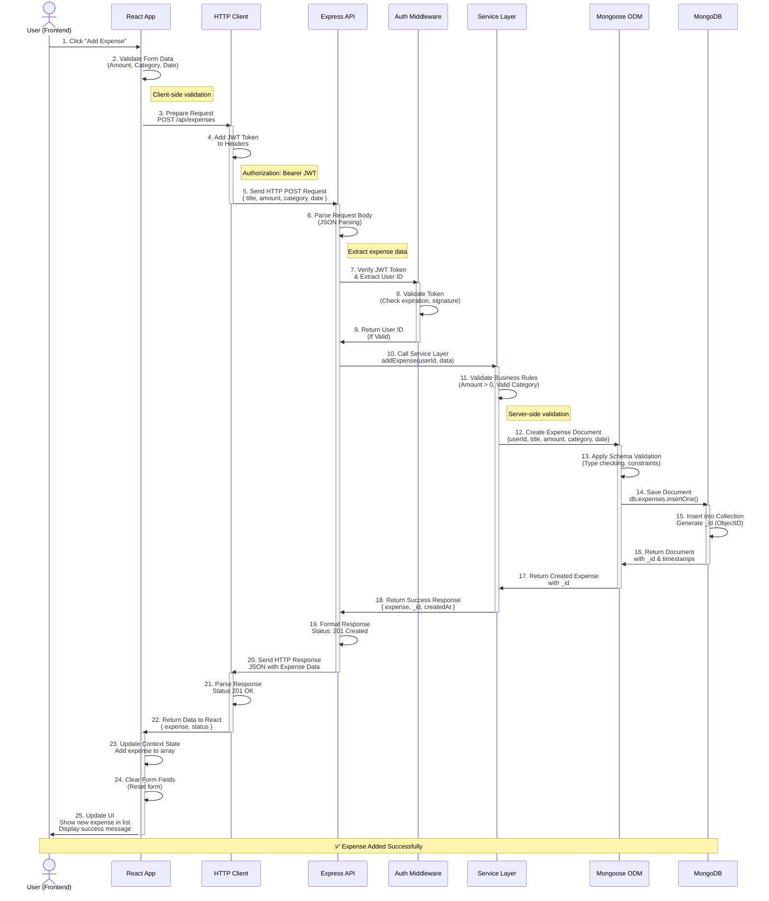
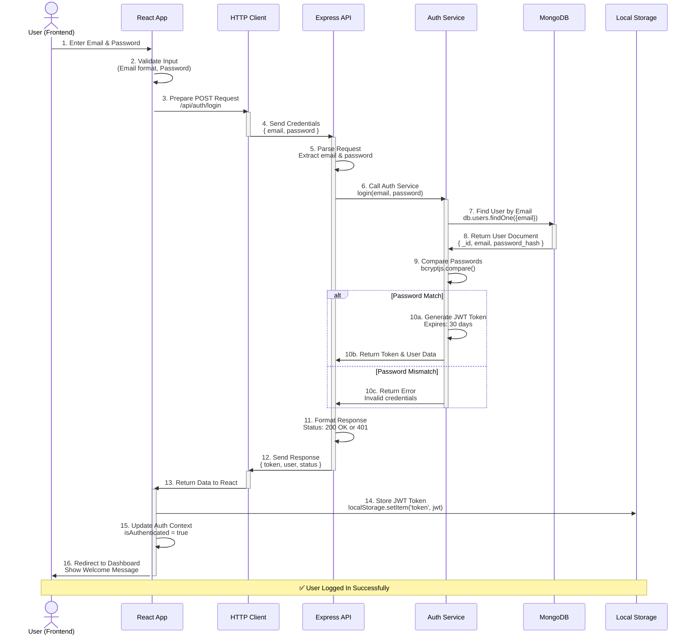
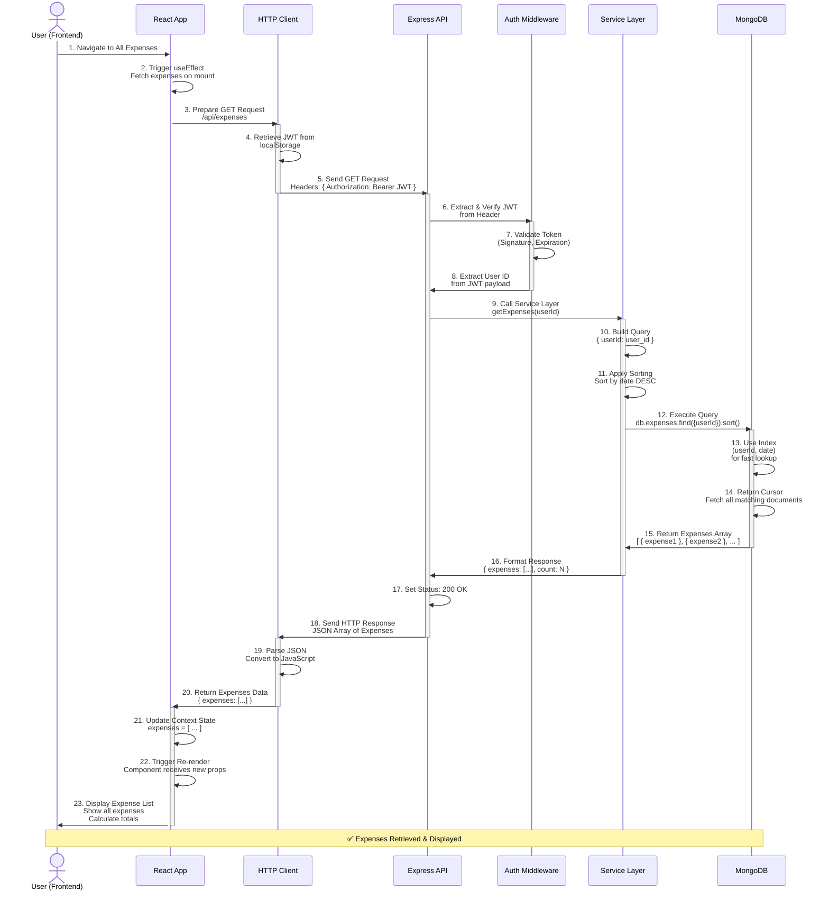
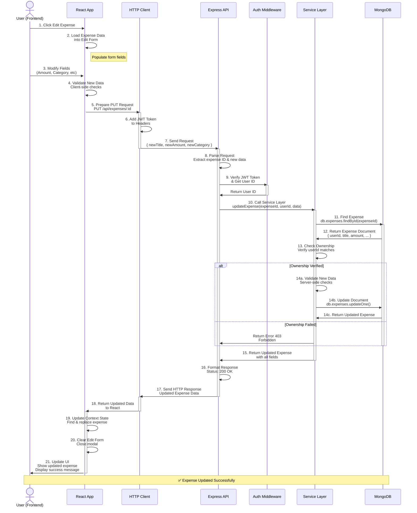
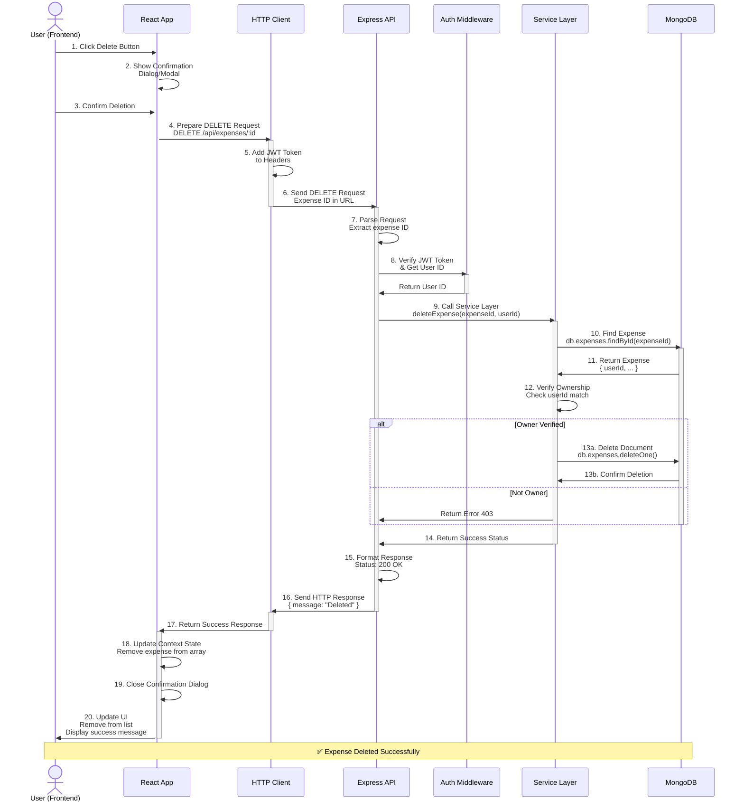
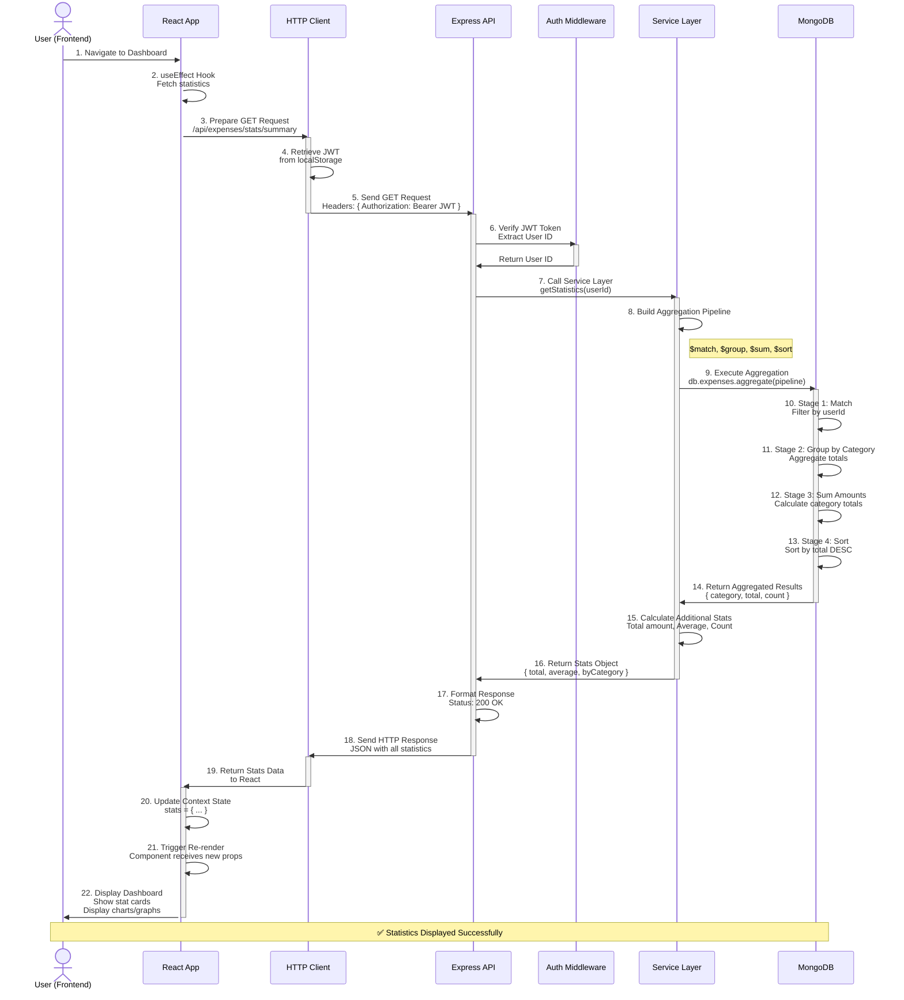

# Data Flow Diagram - Sequence Style (Step-by-Step)

## Complete System Data Flow - Like Sequence Diagram

This diagram shows the step-by-step data flow through your Expense Tracker system, similar to the order management flow in your reference image.

---

## User Login Flow - Step by Step

---

## Fetch All Expenses Flow - Step by Step

---

## Update Expense Flow - Step by Step

---

## Delete Expense Flow - Step by Step

---

## Fetch Statistics Flow - Step by Step

---

## Key Points

### Request Flow (Client → Server → Database)
✅ User action triggered
✅ Client-side validation
✅ Add JWT token to headers
✅ Send HTTP request
✅ Server receives & parses
✅ Middleware validates JWT
✅ Service layer processes
✅ Database operation executed
✅ Response formatted
✅ Sent back to client

### Response Flow (Database → Server → Client)
✅ Database returns results
✅ Mongoose formats data
✅ Service processes results
✅ Middleware adds response headers
✅ Express sends HTTP response
✅ Axios parses response
✅ React updates state
✅ Component re-renders
✅ UI updated for user

### Error Handling at Each Step
✅ **Client**: Form validation errors
✅ **Axios**: Network errors, timeouts
✅ **Middleware**: JWT verification failures
✅ **Service**: Business logic validation
✅ **Database**: Query execution errors

---

## Color Scheme Reference
- **Background**: #383854 (Deep Navy/Purple)
- **Borders/Text**: #d3d3d3 (Light Gray)
- **Boxes**: #e8e8e8 (Light Gray)
- **Text**: #383854 (Dark Navy)
