# Schema Relationship Diagram - Expense Tracker

## Database Schema & Entity Relationships

This diagram illustrates the data model relationships between User and Expense entities in the MongoDB database, showing all fields, data types, and how they interact.


## Schema Details

### User Collection

| Field | Type | Description | Constraints |
|-------|------|-------------|-------------|
| `_id` | ObjectID | MongoDB unique identifier | Primary Key, Auto-generated |
| `name` | String | User's full name | Required, Max 50 chars |
| `email` | String | User's email address | Required, Unique, Valid format |
| `password` | String | Hashed password | Required, Min 6 chars, Bcrypt hashed |
| `createdAt` | DateTime | Account creation timestamp | Auto-generated |
| `updatedAt` | DateTime | Last modification timestamp | Auto-updated |

**Indexes:**
- Unique index on `email` field for fast lookups and constraint enforcement

**Methods:**
- `hashPassword(password)` - Hash password using bcrypt with salt=10
- `comparePassword(enteredPassword)` - Compare entered password with stored hash
- `toJSON()` - Serialize user object (excludes password)

---

### Expense Collection

| Field | Type | Description | Constraints |
|-------|------|-------------|-------------|
| `_id` | ObjectID | MongoDB unique identifier | Primary Key, Auto-generated |
| `user` | ObjectID | Reference to User document | Required, Foreign Key |
| `title` | String | Expense title/name | Required, Max 100 chars |
| `amount` | Number | Amount spent | Required, Min 0.01 |
| `category` | String | Expense category | Required, Enum validation |
| `description` | String | Detailed description | Optional, Max 500 chars |
| `date` | DateTime | Transaction date | Required, Default: Current date |
| `createdAt` | DateTime | Record creation timestamp | Auto-generated |
| `updatedAt` | DateTime | Last modification timestamp | Auto-updated |

**Indexes:**
- Compound index on `user` and `date` (descending) for optimized queries
- Format: `{ user: 1, date: -1 }`

**Category Enum Values:**
- Food 🍔
- Transportation 🚗
- Entertainment 🎬
- Healthcare 🏥
- Shopping 🛍️
- Bills 💡
- Education 📚
- Travel ✈️
- Other 📝

**Validation Rules:**
- Title: Required, non-empty string
- Amount: Must be > 0.01
- Category: Must be from enum list
- Date: Valid ISO 8601 format
- Description: Optional but max 500 characters

---

## Relationships

### One-to-Many (1:N)
- **User → Expense**: One user can have multiple expenses
- **Cardinality**: User (1) --- owns --- (0..*) Expense
- **Foreign Key**: `Expense.user` references `User._id`
- **Cascading**: When a user is deleted, consider cascade delete for their expenses

### Access Pattern
```
User.findById(userId)
  → Expense.find({ user: userId })
     ↓
  Returns all expenses owned by that user
```

---

## API Query Operations

### Read Operations Flow Diagram

```mermaid
%%{init: {'primaryColor': '#383854', 'primaryBorderColor': '#d3d3d3', 'lineColor': '#d3d3d3', 'textColor': '#d3d3d3', 'mainBkg': '#383854', 'secondBkg': '#383854', 'tertiaryColor': '#383854', 'tertiaryBorderColor': '#d3d3d3'}}%%
graph TD
    A["🌐 Client Request"] --> B["📨 HTTP GET Request"]
    B --> C["🔐 Auth Middleware<br/>Verify JWT Token"]
    C --> D{Token Valid?}
    D -->|No| E["❌ Return 401 Unauthorized"]
    D -->|Yes| F["👤 Extract userId<br/>from Token"]
    F --> G["📍 Route Handler<br/>GET /api/expenses"]
    G --> H["📥 Parse Query Parameters<br/>page, limit, category,<br/>startDate, endDate"]
    H --> I["🔍 Build Filter Object"]
    I --> J["Database Query"]
    J --> K["💾 Expense.find(filter)<br/>.sort({date: -1})<br/>.limit(limit)<br/>.skip(offset)"]
    K --> L["🗄️ MongoDB<br/>Execute Query"]
    L --> M["📊 Database Index Lookup<br/>{user: 1, date: -1}"]
    M --> N["🔎 Retrieve Matching<br/>Expense Documents"]
    N --> O["📦 Format Response<br/>with Pagination Info"]
    O --> P["✅ Return 200 OK<br/>with Expense Data"]
    P --> Q["📤 HTTP Response"]
    Q --> R["🎨 Client Renders Data"]
    
    style A fill:#2a5f3f,stroke:#d3d3d3
    style B fill:#2a5f3f,stroke:#d3d3d3
    style C fill:#5f2a3f,stroke:#d3d3d3
    style D fill:#5f4a2a,stroke:#d3d3d3
    style E fill:#8b2e2e,stroke:#d3d3d3
    style F fill:#5f2a3f,stroke:#d3d3d3
    style G fill:#3a4a5f,stroke:#d3d3d3
    style H fill:#3a4a5f,stroke:#d3d3d3
    style I fill:#3a4a5f,stroke:#d3d3d3
    style J fill:#4a3a5f,stroke:#d3d3d3
    style K fill:#4a3a5f,stroke:#d3d3d3
    style L fill:#5f4a3a,stroke:#d3d3d3
    style M fill:#5f4a3a,stroke:#d3d3d3
    style N fill:#5f4a3a,stroke:#d3d3d3
    style O fill:#3a5f4a,stroke:#d3d3d3
    style P fill:#2a5f3f,stroke:#d3d3d3
    style Q fill:#2a5f3f,stroke:#d3d3d3
    style R fill:#2a5f3f,stroke:#d3d3d3
```



### Read Operations - Code Examples

**Get all expenses for a user:**
```javascript
// Route Handler
router.get('/', auth, async (req, res) => {
  try {
    const { page = 1, limit = 10, category, startDate, endDate } = req.query;
    
    // Build filter object
    const filter = { user: req.user.id };
    
    if (category && category !== 'All') {
      filter.category = category;
    }
    
    if (startDate || endDate) {
      filter.date = {};
      if (startDate) filter.date.$gte = new Date(startDate);
      if (endDate) filter.date.$lte = new Date(endDate);
    }

    // Execute query with pagination and sorting
    const expenses = await Expense.find(filter)
      .sort({ date: -1 })
      .limit(limit * 1)
      .skip((page - 1) * limit)
      .populate('user', 'name email');
    
    // Count total for pagination
    const total = await Expense.countDocuments(filter);

    res.json({
      expenses,
      totalPages: Math.ceil(total / limit),
      currentPage: page,
      totalExpenses: total
    });
  } catch (error) {
    res.status(500).json({ message: 'Server error' });
  }
});
```

**Filter expenses by category:**
```javascript
// Frontend API Call
const getExpensesByCategory = (category) => {
  return apiClient.get('/expenses', {
    params: {
      category: category,
      page: 1,
      limit: 10
    }
  });
};

// Backend Query
const filter = { 
  user: req.user.id, 
  category: category 
};

const expenses = await Expense.find(filter)
  .sort({ date: -1 });
```

**Filter expenses by date range:**
```javascript
// Frontend API Call
const getExpensesByDateRange = (startDate, endDate) => {
  return apiClient.get('/expenses', {
    params: {
      startDate: startDate,
      endDate: endDate,
      page: 1,
      limit: 10
    }
  });
};

// Backend Query
const filter = {
  user: req.user.id,
  date: {
    $gte: new Date(startDate),
    $lte: new Date(endDate)
  }
};

const expenses = await Expense.find(filter)
  .sort({ date: -1 });
```

**Get expense statistics:**
```javascript
// Route Handler
router.get('/stats/summary', auth, async (req, res) => {
  try {
    // Aggregation Pipeline
    const stats = await Expense.aggregate([
      // Stage 1: Match - Filter expenses for current user
      { $match: { user: req.user._id } },
      
      // Stage 2: Group - Group by category and sum amounts
      {
        $group: {
          _id: '$category',
          totalAmount: { $sum: '$amount' },
          count: { $sum: 1 }
        }
      },
      
      // Stage 3: Sort - Sort by total amount descending
      { $sort: { totalAmount: -1 } }
    ]);
    
    // Get total expenses count and amount
    const totalExpenses = await Expense.countDocuments({ user: req.user.id });
    const totalAmount = await Expense.aggregate([
      { $match: { user: req.user._id } },
      { $group: { _id: null, total: { $sum: '$amount' } } }
    ]);

    res.json({
      categoryStats: stats,
      totalExpenses,
      totalAmount: totalAmount[0]?.total || 0
    });
  } catch (error) {
    res.status(500).json({ message: 'Server error' });
  }
});
```

**Get single expense by ID:**
```javascript
// Route Handler
router.get('/:id', auth, async (req, res) => {
  try {
    // Find expense by ID
    const expense = await Expense.findById(req.params.id);

    if (!expense) {
      return res.status(404).json({ message: 'Expense not found' });
    }

    // Authorization check - user can only access their own expenses
    if (expense.user.toString() !== req.user.id) {
      return res.status(401).json({ message: 'Not authorized' });
    }

    res.json(expense);
  } catch (error) {
    if (error.kind === 'ObjectId') {
      return res.status(404).json({ message: 'Expense not found' });
    }
    res.status(500).json({ message: 'Server error' });
  }
});
```

### Write Operations

**Create expense:**
```javascript
new Expense({
  user: userId,
  title: string,
  amount: number,
  category: enum,
  description: string,
  date: Date
})
```

**Update expense:**
```javascript
Expense.findByIdAndUpdate(expenseId, updateData, {
  new: true,
  runValidators: true
})
```

**Delete expense:**
```javascript
Expense.findByIdAndDelete(expenseId)
```

---

## Authentication & Authorization

### JWT Token Structure
```javascript
{
  userId: ObjectID,
  iat: timestamp,
  exp: timestamp
}
```

### Middleware Auth Flow
1. Extract JWT from request header: `Authorization: Bearer <token>`
2. Verify token and extract userId
3. Validate user exists in database
4. Attach `req.user` to request context
5. Only allow access to user's own expenses

---

## Data Integrity & Constraints

### Unique Constraints
- `User.email` - Ensures no duplicate emails
- `User._id` - MongoDB ObjectID uniqueness

### Required Fields
- User: `name`, `email`, `password`
- Expense: `user`, `title`, `amount`, `category`, `date`

### Default Values
- `Expense.date` - Defaults to current datetime if not provided
- `User.createdAt` - Set on user creation
- `Expense.createdAt` - Set on expense creation

### Validation
- Email format validation for User
- Enum validation for category
- Numeric range validation for amount
- String length constraints for title and description

---

## Performance Considerations

### Index Strategy
```javascript
// Primary lookup by user and recent date
Expense.collection.createIndex({ user: 1, date: -1 })

// This enables:
// - Fast retrieval of user's expenses
// - Efficient sorting by date
// - Supports pagination queries
// - Optimizes aggregation queries
```

### Query Optimization
- Use pagination (limit + skip) for large result sets
- Filter at database level, not in application
- Use aggregation pipeline for statistics
- Denormalize user data in responses only (not stored)

---

## ERD Legend

- **PK**: Primary Key (Unique identifier)
- **FK**: Foreign Key (References another table)
- **UK**: Unique Key
- **1**: One relationship
- *****: Many relationship
- `||--o{`: One-to-Many relationship notation

---

**Last Updated**: November 11, 2025  
**Database**: MongoDB with Mongoose ODM  
**Color Theme**: Dark mode (#383854 primary, #d3d3d3 text)
