# Expense Tracker - Use Case Diagram (Same Structure as Restaurant System)

## 📊 Simple Structural Use Case Diagram

This diagram follows the exact same structural format as your restaurant system example with clear actor-to-use-case relationships.

---

## 🎯 Best Mermaid Code - Exact Structure

```mermaid
%%{init: {'primaryColor': '#383854', 'primaryBorderColor': '#d3d3d3', 'lineColor': '#d3d3d3', 'textColor': '#d3d3d3', 'mainBkg': '#383854', 'secondBkg': '#383854', 'tertiaryColor': '#383854'}}%%
graph TD
    User["👤 User"]
    System["⚙️ System"]
    Admin["👤 Admin"]
    
    User -->|Browse| ViewExp["View Expenses"]
    User -->|Add| AddExp["Add Expense"]
    User -->|Search| FilterExp["Filter Expenses"]
    User -->|Analyze| StatsExp["View Statistics"]
    User -->|Track| TrackExp["Track Expense"]
    User -->|Manage| EditExp["Edit Expense"]
    
    System -->|Validate| ValidateExp["Validate Data"]
    System -->|Calculate| CalcExp["Calculate Statistics"]
    System -->|Generate| TokenExp["Generate JWT"]
    
    Admin -->|Configure| ManageCat["Manage Categories"]
    Admin -->|View| ViewAnalytics["View Analytics"]
    
    style User fill:#383854,stroke:#d3d3d3,stroke-width:2px,color:#d3d3d3,font-size:13px,font-weight:bold
    style System fill:#383854,stroke:#d3d3d3,stroke-width:2px,color:#d3d3d3,font-size:13px,font-weight:bold
    style Admin fill:#383854,stroke:#d3d3d3,stroke-width:2px,color:#d3d3d3,font-size:13px,font-weight:bold
    
    style ViewExp fill:#e8e8e8,stroke:#383854,stroke-width:2px,color:#383854,font-size:12px,font-weight:600
    style AddExp fill:#e8e8e8,stroke:#383854,stroke-width:2px,color:#383854,font-size:12px,font-weight:600
    style FilterExp fill:#e8e8e8,stroke:#383854,stroke-width:2px,color:#383854,font-size:12px,font-weight:600
    style StatsExp fill:#e8e8e8,stroke:#383854,stroke-width:2px,color:#383854,font-size:12px,font-weight:600
    style TrackExp fill:#e8e8e8,stroke:#383854,stroke-width:2px,color:#383854,font-size:12px,font-weight:600
    style EditExp fill:#e8e8e8,stroke:#383854,stroke-width:2px,color:#383854,font-size:12px,font-weight:600
    
    style ValidateExp fill:#e8e8e8,stroke:#383854,stroke-width:2px,color:#383854,font-size:12px,font-weight:600
    style CalcExp fill:#e8e8e8,stroke:#383854,stroke-width:2px,color:#383854,font-size:12px,font-weight:600
    style TokenExp fill:#e8e8e8,stroke:#383854,stroke-width:2px,color:#383854,font-size:12px,font-weight:600
    
    style ManageCat fill:#e8e8e8,stroke:#383854,stroke-width:2px,color:#383854,font-size:12px,font-weight:600
    style ViewAnalytics fill:#e8e8e8,stroke:#383854,stroke-width:2px,color:#383854,font-size:12px,font-weight:600
```



---

## 📸 Visual Representation

```
                                    ┌─────────────┐
                                    │   System    │
                                    └─────────────┘
                                          │
                                ┌─────────┼─────────┐
                                │         │         │
                             Validate Calculate Generate
                                │         │         │
                                ▼         ▼         ▼
                          ┌──────────┬──────────┬────────┐
                          │ Validate │Calculate │Generate│
                          │   Data   │Statistics│  JWT   │
                          └──────────┴──────────┴────────┘

┌────────────┐                                              ┌──────────┐
│   User     │                                              │  Admin   │
└────────────┘                                              └──────────┘
      │                                                           │
    ┌─┴──────────────────────────────────┬───────────┐            │
    │          │          │          │   │      │    │            │
 Browse     Add      Search    Analyze  Track  Manage  │      Configure  View
    │        │        │        │         │      │     │            │     │
    ▼        ▼        ▼        ▼         ▼      ▼     ▼            ▼     ▼
┌─────────┬──────────┬──────────┬──────────┬────────┬─────────┐ ┌──────────┬────────────┐
│ View    │ Add      │ Filter   │ View     │ Track  │ Edit    │ │ Manage   │ View       │
│Expenses │Expense   │Expenses  │Statistics│Expense │Expense  │ │Categories│Analytics   │
└─────────┴──────────┴──────────┴──────────┴────────┴─────────┘ └──────────┴────────────┘
```

---

## 📋 Use Case Explanation

### **User Actions (6 Main Use Cases)**

| # | Use Case | Description |
|---|----------|-------------|
| 1 | 👁️ **View Expenses** | Browse and display all expenses |
| 2 | ➕ **Add Expense** | Create a new expense entry |
| 3 | 🔍 **Filter Expenses** | Search by category, date, amount |
| 4 | 📊 **View Statistics** | See spending analytics and charts |
| 5 | 📍 **Track Expense** | Monitor individual expense status |
| 6 | ✏️ **Edit Expense** | Modify existing expense details |

### **System Operations (3 Support Use Cases)**

| # | Use Case | Description |
|---|----------|-------------|
| 1 | ✔️ **Validate Data** | Check input validity |
| 2 | 🧮 **Calculate Statistics** | Compute metrics and aggregations |
| 3 | 🔑 **Generate JWT** | Create authentication tokens |

### **Admin Actions (2 Management Use Cases)**

| # | Use Case | Description |
|---|----------|-------------|
| 1 | ⚙️ **Manage Categories** | Create/edit expense categories |
| 2 | 📈 **View Analytics** | Monitor system usage and data |

---

## 🎨 Color Scheme (Same as Restaurant Example)

- **🔵 Blue Box** = User Actor
- **🟠 Orange Box** = System Actor
- **🔴 Red Box** = Admin Actor
- **⚪ White Boxes** = Use Cases
- **→ Arrows** = Actor Initiates Use Case

---

## 🔄 How It Works

### **Example 1: User Adding an Expense**
```
User
  ↓
Add Expense (Use Case)
  ↓
System validates the input
  ↓
Data stored successfully
  ↓
Statistics automatically recalculated
```

### **Example 2: Admin Managing System**
```
Admin
  ↓
Manage Categories (Use Case)
  ↓
System validates new category
  ↓
Category stored in database
```

---

## 💡 Key Points

✅ **Simple Structure** - Easy to understand
✅ **3 Clear Actors** - User, System, Admin
✅ **11 Use Cases** - All main features covered
✅ **Direct Relationships** - Simple arrow connections
✅ **Professional Look** - Similar to your restaurant example
✅ **Scalable Design** - Easy to add more features

---

## 🚀 How to Use

### **1. In GitHub README**
```markdown
## Use Case Diagram

```mermaid
[Paste the mermaid code here]
```
```

### **2. In Any Markdown File**
Simply copy the mermaid code block and paste it.

### **3. Live Preview**
Visit https://mermaid.live and paste the code to see it rendered.

### **4. Share with Team**
- Right-click on rendered diagram
- Save as PNG/SVG
- Share in presentations

---

## 📊 Complete Feature Matrix

| Feature | User | System | Admin |
|---------|------|--------|-------|
| View Expenses | ✅ | - | ✅ |
| Add Expense | ✅ | ✅ | - |
| Filter Expenses | ✅ | - | - |
| View Statistics | ✅ | ✅ | ✅ |
| Track Expense | ✅ | - | - |
| Edit Expense | ✅ | ✅ | - |
| Manage Categories | - | ✅ | ✅ |
| View Analytics | - | - | ✅ |
| Validate Data | - | ✅ | - |
| Calculate Stats | - | ✅ | - |
| Generate JWT | - | ✅ | - |

---

## 📝 Actor Definitions

### **👤 User**
- Regular application user
- Creates and manages personal expenses
- Views analytics
- Filters and searches expenses

### **⚙️ System**
- Automated background processes
- Data validation
- Statistics calculation
- Token generation
- Authentication

### **👤 Admin**
- System administrator
- Manages categories
- Views system analytics
- Monitors user activity

---

## ✨ Perfect for Your Project!

This diagram:
- ✅ Matches your restaurant system style
- ✅ Shows all main features
- ✅ Clear actor relationships
- ✅ Easy to present
- ✅ Professional appearance
- ✅ Ready to use in documentation

---

**Copy the Mermaid code above and use it in your GitHub README or documentation!** 🚀
